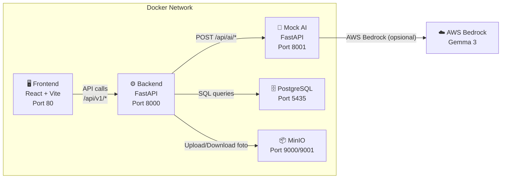
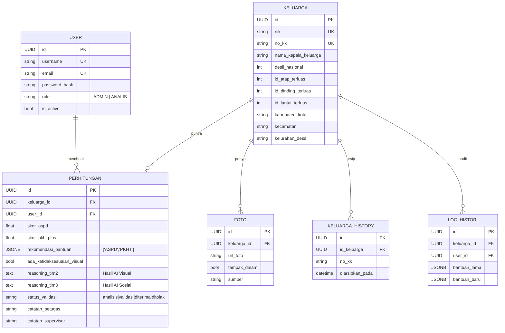
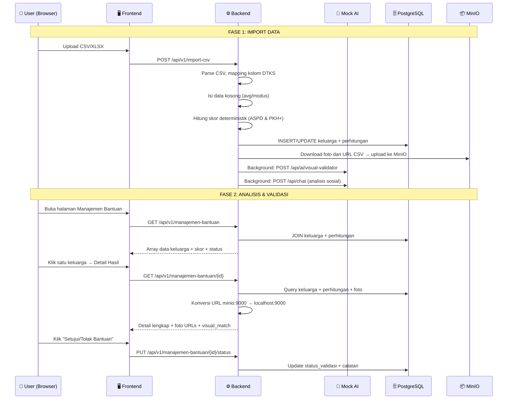

# 📖 Dokumentasi Sistem: Pemetaan Kemiskinan & Bantuan Jawa Timur

> Dokumen ini menjelaskan **seluruh arsitektur, alur data, dan logika** di balik sistem ini.
> Terakhir diperbarui: 2 Juni 2026

---

## 1. Arsitektur Infrastruktur (Docker Compose)

Sistem berjalan di **5 container Docker** yang saling terhubung:



| Container | Image | Port Host → Container | Fungsi |
|---|---|---|---|
| `mkn_frontend` | Vite dev server | **80** → 5173 | Antarmuka pengguna (React) |
| `mkn_backend` | FastAPI + Uvicorn | **8000** → 8000 | API utama, orkestrasi data |
| `mkn_mock_ai` | FastAPI + Uvicorn | **8001** → 8001 | Simulasi AI Tim 2 & Tim 3 |
| `mkn_db` | PostgreSQL 15 | **5435** → 5432 | Database utama |
| `mkn_minio` | MinIO S3 | **9000** → 9000 | Penyimpanan foto rumah |

### File Konfigurasi Utama
- [docker-compose.yml](file:///d:/Coding/MVP-Apps-Pemetaan_Kemiskinan_dan_Bantuan/docker-compose.yml) — Definisi semua container
- [.env](file:///d:/Coding/MVP-Apps-Pemetaan_Kemiskinan_dan_Bantuan/.env) — Kredensial DB, MinIO, JWT, AWS

---

## 2. Skema Database (6 Tabel)

Didefinisikan di [models.py](file:///d:/Coding/MVP-Apps-Pemetaan_Kemiskinan_dan_Bantuan/jatim-sosial-backend/app/models.py):



### Tabel Kunci & Fungsinya

| Tabel | Fungsi | Kolom Penting |
|---|---|---|
| **keluarga** | Data utama warga (dari CSV DTKS) | `nik`, `no_kk`, `desil_nasional`, 50+ variabel sosial-ekonomi |
| **perhitungan** | Hasil analisis AI + status validasi | `skor_aspd`, `skor_pkh_plus`, `rekomendasi_bantuan`, `status_validasi` |
| **foto** | URL foto rumah di MinIO | `url_foto`, `tampak_dalam` (luar/dalam) |
| **keluarga_history** | Arsip data lama saat ada perubahan | Duplikat semua kolom keluarga + timestamp |
| **log_histori** | Audit trail perubahan bantuan | `bantuan_lama`, `bantuan_baru` |
| **user** | Akun login petugas/admin | `role`: ADMIN atau ANALIS |

---

## 3. Alur Data End-to-End



---

## 4. Backend — Endpoint API

Semua endpoint didefinisikan di folder [routers/](file:///d:/Coding/MVP-Apps-Pemetaan_Kemiskinan_dan_Bantuan/jatim-sosial-backend/app/routers).

### 4.1 Auth ([auth.py](file:///d:/Coding/MVP-Apps-Pemetaan_Kemiskinan_dan_Bantuan/jatim-sosial-backend/app/routers/auth.py))

| Method | Endpoint | Fungsi |
|---|---|---|
| POST | `/api/v1/auth/register` | Registrasi user baru |
| POST | `/api/v1/auth/login` | Login, mengembalikan JWT token |

**Mekanisme Auth:** JWT token (expire 60 menit) → disimpan di `localStorage` browser → dikirim via header `Authorization: Bearer <token>` oleh [api.ts](file:///d:/Coding/MVP-Apps-Pemetaan_Kemiskinan_dan_Bantuan/jatim-sosial-frontend/src/services/api.ts).

### 4.2 Data & Bantuan ([items.py](file:///d:/Coding/MVP-Apps-Pemetaan_Kemiskinan_dan_Bantuan/jatim-sosial-backend/app/routers/items.py))

| Method | Endpoint | Fungsi | Logika Penting |
|---|---|---|---|
| POST | `/api/v1/import-csv` | Import data CSV/XLSX | Idempoten (cek duplikat KK), auto-download foto, hitung skor, trigger AI background |
| GET | `/api/v1/manajemen-bantuan` | Ambil semua data tabel | JOIN keluarga + perhitungan, mapping 50+ variabel dinamis |
| GET | `/api/v1/manajemen-bantuan/{id}` | Detail satu keluarga | Termasuk foto URLs (dikonversi ke publik), material rumah, visual_match |
| PUT | `/api/v1/manajemen-bantuan/{id}/status` | Update status validasi | Ubah `status_validasi`, `rekomendasi_bantuan`, `catatan` |
| GET | `/api/v1/keluarga` | List keluarga (pagination) | Endpoint CRUD dasar |
| GET | `/api/v1/keluarga/{id}/histori` | Riwayat perubahan | Audit trail dari tabel `log_histori` |

### 4.3 Asesmen AI ([asesmen.py](file:///d:/Coding/MVP-Apps-Pemetaan_Kemiskinan_dan_Bantuan/jatim-sosial-backend/app/routers/asesmen.py))

| Method | Endpoint | Fungsi | Target AI |
|---|---|---|---|
| POST | `/api/v1/asesmen/sosial` | Trigger analisis kelayakan bantuan | Mock AI → `/api/chat` (Tim 3) |
| POST | `/api/v1/asesmen/visual/{id}` | Trigger validasi foto rumah | Mock AI → `/api/ai/visual-validator` (Tim 2) |

### 4.4 Users ([users.py](file:///d:/Coding/MVP-Apps-Pemetaan_Kemiskinan_dan_Bantuan/jatim-sosial-backend/app/routers/users.py))

| Method | Endpoint | Fungsi |
|---|---|---|
| GET | `/api/v1/users` | List semua user |
| GET | `/api/v1/users/me` | Profil user saat ini |
| PUT | `/api/v1/users/me` | Update profil sendiri |
| POST | `/api/v1/users` | Buat user baru (admin only) |
| PATCH | `/api/v1/users/{id}` | Update role/status |
| DELETE | `/api/v1/users/{id}` | Hapus user |

---

## 5. Mock AI Server ([mock_ai.py](file:///d:/Coding/MVP-Apps-Pemetaan_Kemiskinan_dan_Bantuan/jatim-sosial-backend/mock_ai.py))

Server terpisah (port 8001) yang **mensimulasikan** respons AI Tim 2 dan Tim 3.

### 5.1 Jalur Sosial (Tim 3) — `/api/ai/jalur-sosial`
1. **Mencoba** memanggil AWS Bedrock (Google Gemma 3) untuk analisis LLM sesungguhnya
2. **Jika gagal** (AWS key kosong/error) → fallback ke aturan deterministik (`hitung_skor_deterministik`)
3. **Output:** `rekomendasi_bantuan: ["ASPD", "PKHT"]`, `skor_aspd`, `skor_pkh_plus`

### 5.2 Visual Validator (Tim 2) — `/api/ai/visual-validator`
1. **Mencoba** memanggil AWS Bedrock untuk menghasilkan reasoning teks
2. **Jika gagal** → fallback ke teks statis ("Foto SESUAI/TIDAK SESUAI...")
3. `is_match` ditentukan secara **random** (75% true, 25% false) — ini murni mock
4. **Output:** `is_match: bool`, `reasoning: string`

> [!WARNING]
> **Visual Validator TIDAK menganalisis foto sesungguhnya.** `is_match` adalah random. Reasoning teks dihasilkan oleh Gemma 3 atau fallback statis. Backend Tim 2 yang sesungguhnya belum terintegrasi.

### 5.3 Formula Skor Deterministik

Didefinisikan di fungsi `hitung_skor_deterministik()`:

**Skor ASPD (Asistensi Sosial Penyandang Disabilitas):**
| Komponen | Bobot Maks | Kriteria |
|---|---|---|
| Disabilitas | 60 poin | `id_disabilitas > 0` (+40), tingkat BERAT (+20) / SEDANG (+12) / RINGAN (+5), flag `aspd=1` (+15) |
| Kemandirian | 20 poin | Skor kesulitan dari 4 variabel ADL (mengurus diri, berjalan, belajar, berbicara) |
| Desil Ekonomi | 10 poin | Desil 1 (+10), Desil 2 (+8), Desil 3 (+6), Desil 4 (+4) |
| **Skor Dasar** | 10 poin | Semua keluarga mendapat 10 poin awal |

**Skor PKH Plus (Program Keluarga Harapan Plus):**
| Komponen | Bobot Maks | Kriteria |
|---|---|---|
| Desil & Kemiskinan | 45 poin | Desil 1 (+25) / 2 (+20) / 3 (+15) / 4 (+10), flag `kemiskinan_ekstrem=1` (+10), flag `pkh_plus=1` (+10) |
| Material Rumah | 25 poin | `id_lantai >= 3` (+10), `id_dinding >= 2` (+8), `id_atap >= 3` (+7) |
| Ketiadaan Aset | 20 poin | Tidak punya motor (+8), kulkas (+5), TV (+4), AC (+3) |
| Jumlah Anggota | 10 poin | >= 5 orang (+10), >= 3 orang (+5) |
| **Skor Dasar** | 10 poin | Semua keluarga mendapat 10 poin awal |

---

## 6. Frontend — Halaman & Komponen

Routing didefinisikan di [App.tsx](file:///d:/Coding/MVP-Apps-Pemetaan_Kemiskinan_dan_Bantuan/jatim-sosial-frontend/src/App.tsx). Semua halaman di bawah `/dashboard` dst. dilindungi oleh `ProtectedRoute` (cek `localStorage.access_token`).

### 6.1 Landing (`/`)
- **File:** [Landing.tsx](file:///d:/Coding/MVP-Apps-Pemetaan_Kemiskinan_dan_Bantuan/jatim-sosial-frontend/src/pages/Landing/Landing.tsx)
- **Fungsi:** Halaman publik, beranda sebelum login
- **Data:** Tidak ada API call

### 6.2 Login (`/login`)
- **File:** [login.tsx](file:///d:/Coding/MVP-Apps-Pemetaan_Kemiskinan_dan_Bantuan/jatim-sosial-frontend/src/pages/Login/login.tsx)
- **Fungsi:** Form login → POST `/api/v1/auth/login` → simpan token di `localStorage`
- **State:** `access_token`, `username`, `role`

### 6.3 Dashboard (`/dashboard`)
- **File:** [dashboard.tsx](file:///d:/Coding/MVP-Apps-Pemetaan_Kemiskinan_dan_Bantuan/jatim-sosial-frontend/src/pages/Dashboard/dashboard.tsx)
- **API:** `GET /api/v1/manajemen-bantuan` (mengambil SEMUA data)
- **Logika:** Menghitung statistik dari array respons:
  - `totalData` = jumlah array
  - `countDiterima` = filter `tahap === 'diterima'`
  - `countDitolak` = filter `tahap === 'ditolak'`
  - Distribusi per desil → Pie Chart (Recharts)
  - Status persetujuan → Bar Chart

### 6.4 Import Data (`/analisis-baru`)
- **File:** [analisisbaru.tsx](file:///d:/Coding/MVP-Apps-Pemetaan_Kemiskinan_dan_Bantuan/jatim-sosial-frontend/src/pages/AnalisisBaru/analisisbaru.tsx)
- **API:** `POST /api/v1/import-csv` (multipart/form-data)
- **Fungsi:** Upload file CSV/XLSX → backend memproses dan menyimpan data ke DB

### 6.5 Manajemen Bantuan (`/manajemen-bantuan`) ⭐ HALAMAN UTAMA
- **File:** [manajemenbantuan.tsx](file:///d:/Coding/MVP-Apps-Pemetaan_Kemiskinan_dan_Bantuan/jatim-sosial-frontend/src/pages/ManajemenBantuan/manajemenbantuan.tsx) (~1400 baris)
- **API:** `GET /api/v1/manajemen-bantuan`
- **Fitur-fitur:**

| Fitur | Logika |
|---|---|
| **Filter Multi-Dimensi** | Kecamatan, Kelurahan, Interseksi Bantuan, Status Tahap, Desil Multi-select |
| **Atur Kolom Dinamis** | Show/Hide 50+ kolom, state disimpan di `localStorage('mb-visible-columns')` |
| **Pengurutan Dinamis** | Klik header → asc/desc. Auto-deteksi tipe: angka (Terkecil/Terbesar) vs teks (A-Z/Z-A) |
| **Batch Analisis** | Checkbox multi-select → trigger AI untuk semua yang dipilih |
| **Paginasi** | 10 item/halaman, navigasi prev/next/numbered |

**Alur Data Internal:**
```
API Response (array) 
  → filteredData (useMemo: filter aktif) 
    → sortedData (useMemo: pengurutan aktif)
      → paginatedData (slice berdasarkan halaman)
        → Render tabel
```

### 6.6 Detail Hasil (`/detail-hasil/:id`) ⭐ HALAMAN VALIDATOR
- **File:** [detailhasil.tsx](file:///d:/Coding/MVP-Apps-Pemetaan_Kemiskinan_dan_Bantuan/jatim-sosial-frontend/src/pages/DetailHasil/detailhasil.tsx) (~1270 baris)
- **API:** `GET /api/v1/manajemen-bantuan/{id}`, `PUT /api/v1/manajemen-bantuan/{id}/status`
- **Fitur-fitur:**

| Bagian | Sumber Data | Keterangan |
|---|---|---|
| **Header Identitas** | `detailData.nama`, `nik`, `wilayah`, `desil` | Dari tabel `keluarga` |
| **Foto Rumah** | `detailData.foto_urls` | URL dari MinIO, dikonversi ke publik oleh backend |
| **Tabel Validator** | Kolom VARIABEL: statis (Atap/Dinding/Lantai) | — |
| ↳ DATA REGISTER | `mapAtap(detailData.atap)` dll. | Mapping ID → nama material |
| ↳ PREDIKSI AI | `getAtapVisual()` dll. | ⚠️ **MOCK** — logika hardcoded di frontend, BUKAN dari AI |
| ↳ STATUS | `renderVisualMatchBadge(visual_match)` | Dari `perhitungan.ada_ketidaksesuaian_visual` |
| ↳ ALASAN DETEKSI | `detailData.visual_reasoning` | Dari `perhitungan.reasoning_tim2` |
| **Ringkasan AI** | `detailData.aiReasoning` | Dari `perhitungan.reasoning_tim3` (markdown) |
| **Rekomendasi Bantuan** | Array `recommendations` (ASPD, PKH+) | Skor dari `perhitungan.skor_aspd/skor_pkh_plus` |
| **Panel Validasi** (kanan) | `catatan`, `catatan_supervisor` | Textarea + tombol Setujui/Tolak |

**Alur Status Validasi:**
```
analisis → (Setujui) → diterima
analisis → (Tolak)   → ditolak
```

### 6.7 Detail Keluarga (`/detail-keluarga/:id`)
- **File:** [detailkeluarga.tsx](file:///d:/Coding/MVP-Apps-Pemetaan_Kemiskinan_dan_Bantuan/jatim-sosial-frontend/src/pages/DetailKeluarga/detailkeluarga.tsx)
- **API:** `GET /api/v1/keluarga/{id}`
- **Fungsi:** Menampilkan SEMUA variabel DTKS (demografi, pekerjaan, aset, disabilitas, dll.)

### 6.8 Pengaturan (`/pengaturan`)
- **File:** [pengaturan.tsx](file:///d:/Coding/MVP-Apps-Pemetaan_Kemiskinan_dan_Bantuan/jatim-sosial-frontend/src/pages/Pengaturan/pengaturan.tsx)
- **API:** Semua endpoint `/api/v1/users/*`
- **Fungsi:** Manajemen akun (CRUD user), ubah profil, ubah role ADMIN/ANALIS

### 6.9 Basis Pengetahuan (`/basis-pengetahuan`)
- **File:** [basispengetahuan.tsx](file:///d:/Coding/MVP-Apps-Pemetaan_Kemiskinan_dan_Bantuan/jatim-sosial-frontend/src/pages/BasisPengetahuan/basispengetahuan.tsx)
- **Fungsi:** Halaman informasi/dokumentasi internal (statis)

---

## 7. Mapping Material Rumah (ID → Nama)

Digunakan di `detailhasil.tsx` untuk menerjemahkan kode integer DTKS:

| ID | Atap | Dinding | Lantai |
|---|---|---|---|
| 1 | Beton | Tembok | Marmer/Granit |
| 2 | Genteng Tanah Liat | Kayu | Keramik |
| 3 | Asbes | Bambu | Ubin/Semen |
| 4 | Seng | Tanah | Kayu |
| 5 | Bambu | Lainnya | Bambu |
| 6 | Jerami/Ijuk | — | Tanah |
| 7 | Lainnya | — | Lainnya |

---

## 8. Masalah yang Diketahui & Catatan Teknis

> [!CAUTION]
> ### Bug yang Sudah Diperbaiki (Sesi Ini)
> 1. **`AttributeError: jenis_atap_terluas`** — Backend mereferensikan kolom yang tidak ada. Fix: `k.id_atap_terluas`
> 2. **Typo `ada_ketidaksesuaian`** — Kurang suffix `_visual`. Fix: `p.ada_ketidaksesuaian_visual`
> 3. **URL foto `minio:9000`** — Browser tidak bisa resolve hostname Docker. Fix: `to_public_foto_url()` + `MINIO_PUBLIC_ENDPOINT`

> [!WARNING]
> ### Limitasi Saat Ini
> 1. **Kolom PREDIKSI AI di validator** → Hardcoded di frontend (`getAtapVisual()` dll.), BUKAN dari AI sesungguhnya
> 2. **Visual Validator** → `is_match` ditentukan random (75/25), bukan analisis foto nyata
> 3. **AWS Bedrock** → Kunci dinonaktifkan (`.env`), semua AI menggunakan fallback rule-based
> 4. **Tidak ada Alembic** → Migrasi DB dilakukan manual via `ensure_column()` dan `create_all()`
> 5. **Tidak ada rate limiting** → API terbuka untuk semua origin (`CORS: *`)

---

## 9. Peta File Penting

```
📁 MVP-Apps-Pemetaan_Kemiskinan_dan_Bantuan/
├── 📄 .env                          ← Kredensial global
├── 📄 docker-compose.yml            ← Definisi 5 container
│
├── 📁 jatim-sosial-backend/
│   ├── 📄 mock_ai.py                ← Server AI simulasi (port 8001)
│   ├── 📁 app/
│   │   ├── 📄 main.py               ← Entry point FastAPI, seeder admin
│   │   ├── 📄 config.py             ← Konfigurasi MinIO, AI URL, port
│   │   ├── 📄 database.py           ← Koneksi PostgreSQL, migrasi manual
│   │   ├── 📄 models.py             ← 6 tabel SQLAlchemy
│   │   ├── 📄 security.py           ← JWT, bcrypt, auth guard
│   │   ├── 📁 routers/
│   │   │   ├── 📄 auth.py           ← Login & Register
│   │   │   ├── 📄 users.py          ← CRUD User
│   │   │   ├── 📄 items.py          ← Import CSV, Manajemen Bantuan, Detail
│   │   │   └── 📄 asesmen.py        ← Trigger AI (visual + sosial)
│   │   └── 📁 schemas/
│   │       └── 📄 item.py           ← Pydantic response models
│
├── 📁 jatim-sosial-frontend/
│   └── 📁 src/
│       ├── 📄 App.tsx               ← Routing (9 halaman)
│       ├── 📁 services/
│       │   └── 📄 api.ts            ← Fetch wrapper + auth interceptor
│       └── 📁 pages/
│           ├── 📁 Landing/          ← Halaman publik
│           ├── 📁 Login/            ← Form login
│           ├── 📁 Dashboard/        ← Statistik & chart
│           ├── 📁 AnalisisBaru/     ← Upload CSV
│           ├── 📁 ManajemenBantuan/ ← Tabel utama (filter, sort, kolom)
│           ├── 📁 DetailHasil/      ← Validator visual + rekomendasi AI
│           ├── 📁 DetailKeluarga/   ← Semua variabel DTKS
│           ├── 📁 Pengaturan/       ← Manajemen akun
│           └── 📁 BasisPengetahuan/ ← Info statis
```
